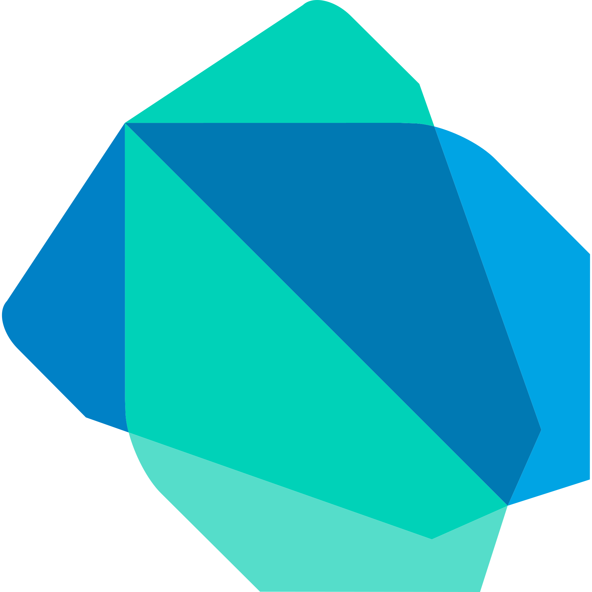

## Hi, I'm [Aditya Sharma](https://adityasharma.co)  

### About Me:

- 🔭 I’m currently working on [YogaGuru](https://github.com/BetaPundit/Yoga-Guru)
- 🌱 I’m forever a student of life
- 👯 I’m looking to collaborate on Deep learning projects
- 🤔 My favourite quote: `Keep it Simple Stupid!`
- 💬 Ask me about Computer Vision & Flutter!
- 📫 How to reach me: [email](mailto:adityaas26@gmail.com), [LinkedIn](https://linkedin.com/in/aditya-sharma26)
- 😄 Pronouns: He/His
- ⚡ Fun fact: I love cats 😻

 

### Skills and Tools:  

 
 
 

### Quick Stats:  

 
 

### Connect with me:

 
 

---

  ### Show some ❤️ by starring some of my repos!

